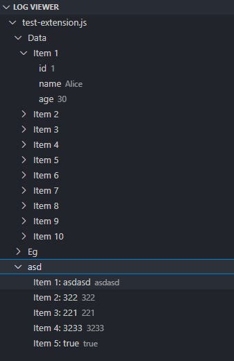

# Log Viewer

A simple and interactive **Log Viewer for VSCode** that lets you see `console.log` outputs directly in the Explorer sidebar — neatly structured and expandable.

## ✨ Features

- Automatically captures `console.log` outputs when saving your file.
- Displays logs grouped by **file name**.
- Expands **objects** and **arrays** into a tree structure.
- Inline tooltips for raw values.
- Supports refreshing logs via command: **Log Viewer: Refresh**.
- For frontend frameworks (React, Angular, Vue):
  - Provides the command **Log Viewer: Create Launch Config** to auto-generate `.vscode/launch.json`.
  - Adds Chrome/Edge debug configuration so you can run & capture logs.

### Example

---

## 🚀 Usage

### Node.js Projects

1. Install the extension.
2. Save any `.js`/`.ts` file with `console.log`.
3. Logs automatically appear in the **Log Viewer** (no setup needed 🎉).

### Frontend Frameworks (React, Angular, Vue, etc.)

1. Run the command **Log Viewer: Create Launch Config**.
   - This will generate a `.vscode/launch.json` with a Chrome/Edge debug configuration.
2. Start the debugger from **Run and Debug**.
3. Save files — logs will appear inside **Debug Console** and the **Log Viewer**.

---

## ⚙️ Extension Settings

This extension contributes the following commands:

- `log-viewer.refresh` → Refresh log output manually.
- `log-viewer.createLaunchConfig` → Auto-create a `launch.json` for frontend frameworks (React, Angular, Vue).

---

## 🛠 Requirements

- **Node.js** installed (for backend).
- For frontend, a Chromium-based browser (Chrome/Edge) is needed.

---

## 📌 Known Issues

- Currently works best with `console.log`.
- Future support may include `console.error`, `console.warn`, etc.
- Debug config is added per project; verify `.vscode/launch.json` exists for frontend.

---

## 📖 Release Notes

### 1.1.0

- NEW: `log-viewer.createLaunchConfig` command for **frontend frameworks**.
- Backend Node.js projects now work **without needing `launch.json`**.

### 1.0.0

- Initial release with:
  - Auto log capture on file save.
  - Tree view for arrays/objects.
  - Manual refresh command.

---

## demo video :

[demo link](https://youtu.be/WoJVHxY-6gA?si=Cmd2rdGoWeLIAELm)

---

## 💡 Contributing

Pull requests and suggestions are welcome!  
[Open an issue](https://github.com/Devamchaudhari/log-viewer) to report bugs or request features.

---

**Enjoy debugging with Log Viewer! 🎉**
